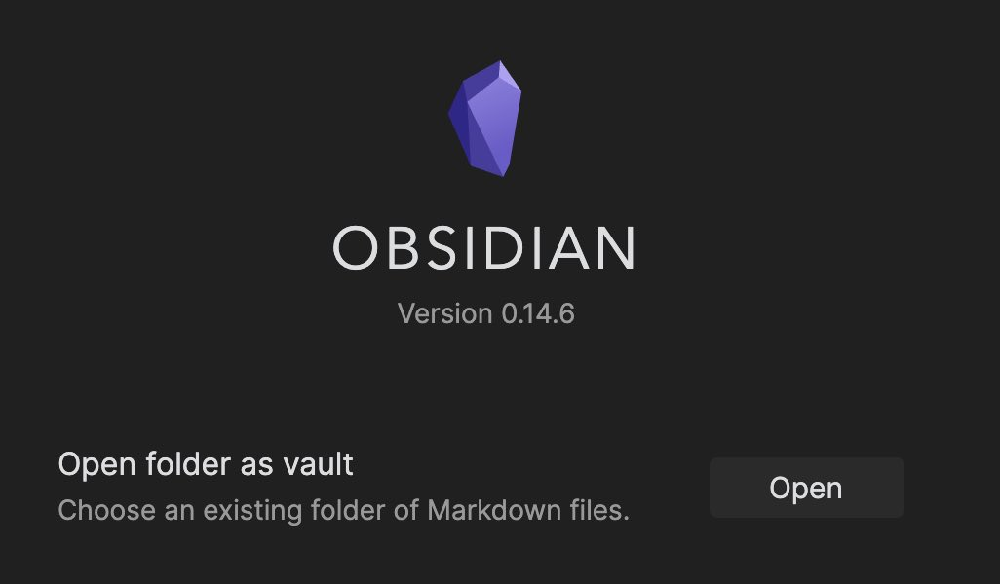
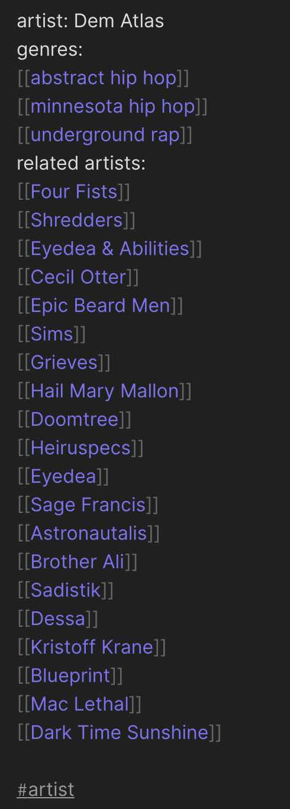
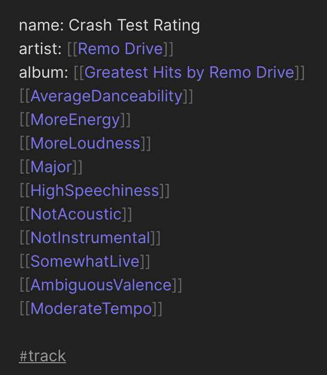
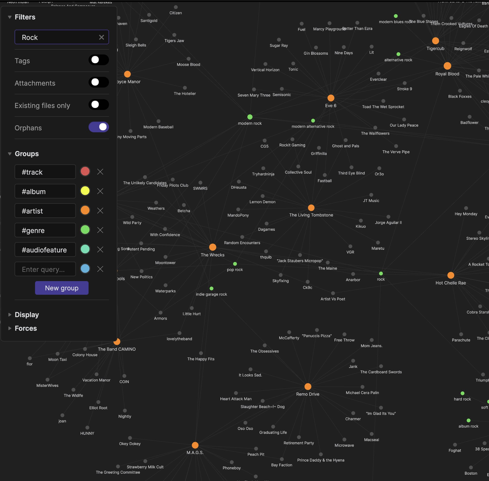
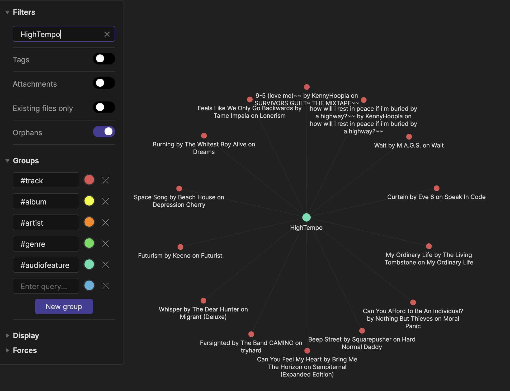
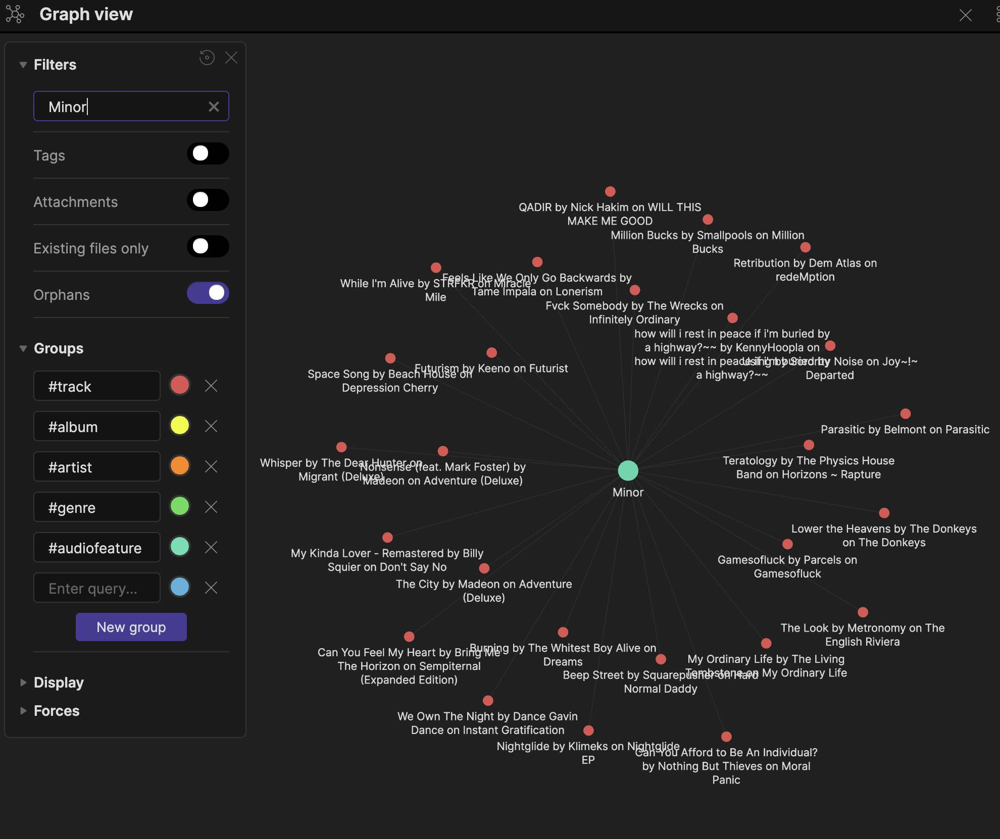

# spobpy
SpObPy allows you to visualize your favorite music in connected graphs based genre and audio features such as tempo, key, danceability and many more. This program utilizes the Spotify API, Obsidian knowledge base app, and is written in Python. Given a text file of tracks and API credentials, the program creates markdown files for tracks, artists, albums, and audio features and with links and tags compatible with Obsidian. A user simply must open the created folder as an Obsidian vault and can explore their music in the interactive graph view.

# Requirements
- install Spotipy
- obtain [Spotify API](https://developer.spotify.com/documentation/web-api/) key 
- install [Obsidian](https://obsidian.md)

# How to Use
1. Create a text file of spotify track links separated by new line.
2. Create a text file named 'client_credentials.txt' with the first line as id and second as secret key.
3. Create a directory the music vault will be created in.
4. Run spobpy.py the first command line argument is the path to track list and the second is the path to the music vault folder.
  Example: 'python3 spobpy.py tracks.txt /Users/ray/Desktop/MusicVault/'
5. Using Obsidian open the folder as a vault:
  
  
# Features
All data can be visualized in the graph view of the vault or insepcted and edited in the respect markdown folder for the artist, album, track, genre, or audio feature. I have specified my own terms for classifying audio features based on numerical values obtained from spotify. These are decided by constants set in spobpy_obsd.py and can be configured or new terms may be added. A future iteraiton of this may use machine learning for classificaiton rather than fixed arbitrary setpoints.
- Genres and related artists will be linked in artist markdown files:
  
- Artists, albums, and audiofeatures will be linked in track markdown files:
  
- Genres can be explored by searching in the filter menu in the graph view:
  
- Likewise, audiofeatures can also be explored by searching in the filter menu in the graph view:
  
  
  The full set of supported audio features by Spotify that classifications are dependent on include:
  - danceability
  - energy
  - loudness
  - mode
  - speechiness
  - acousticness
  - instrumentalness
  - liveness
  - valence
  - tempo
